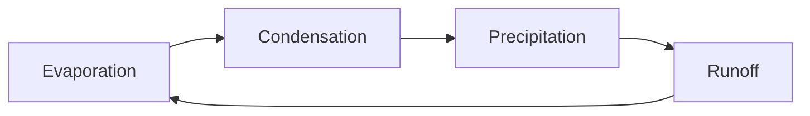

# Mermaid Circular Layout for Obsidian

An Obsidian plugin that adds a circular layout to mermaid flowcharts.
Cycles render as rings instead of dagre's flattened ladders.

The layout itself lives in
[mermaid-layout-circular](https://github.com/AndrewBroz/mermaid-layout-circular),
which has pictures of the output and notes on how the geometry works.
This plugin is a thin adapter: on load it registers the layout with the
mermaid instance Obsidian already bundles.

## Usage

Opt in per diagram with frontmatter inside the mermaid fence:

````

````

Diagrams without the frontmatter are untouched.

## Installation

Until the plugin is in the community catalog, install it manually:

1. Download `main.js` and `manifest.json` from the latest release, or
   build them yourself (below).
2. Copy both into `<your vault>/.obsidian/plugins/mermaid-circular/`.
3. In Obsidian, enable the plugin under Settings, Community plugins.

## Building from source

```sh
npm install
npm run build
```

This bundles the layout engine and the adapter into `main.js`. During
development, `npm run dev` rebuilds on change.

## Requirements

Obsidian 1.13.0 or later, and the requirement is real rather than
cautious. The layout needs mermaid internals that arrived in mermaid
11.12. Obsidian bundled mermaid 11.4.1 from 1.9 through 1.12 and
jumped straight to 11.13.0 in 1.13.0 (per the official changelog), so
1.13.0 is the first release that can run this layout correctly. On
mermaid 11.4 the layout would register and render, but with the exact
defects this engine exists to fix: arrowheads trimmed into box corners
and labels placed by guesswork. An inactive plugin is better than that,
so the version gate stays honest.

One quirk to know: mermaid keeps registered layouts for the life of the
app process, and offers no way to unregister one. Disabling the plugin
stops nothing mid-flight; the layout simply remains available until
Obsidian restarts. This is harmless, but worth knowing.

## License

MIT
