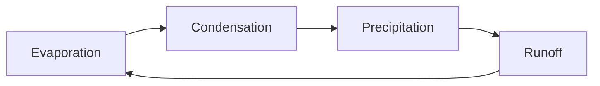

# Mermaid Circular Layout for Obsidian

An Obsidian plugin that adds a circular layout to Mermaid flowcharts.

The layout code is at
[mermaid-layout-circular](https://github.com/AndrewBroz/mermaid-layout-circular),
which shows examples of the output and explains some of the behavior, including
direction mechanics, spoke handling, and branching.
This plugin is a thin adapter. On load, it registers the layout with the
Mermaid instance already bundled with Obsidian.

## Usage

Use the circular layout by setting the config in the front-matter:

````

````

`layout: circular` goes clockwise from the top.
`layout: circular-ccw` is the counter-clockwise variant.

Supports cycles, hub-and-spoke shapes, interlocking cycles, subgraphs etc.

## Installation

Until the plugin is in the community catalog, you can use
[BRAT](https://community.obsidian.md/plugins/obsidian42-brat)
(this is what I do, personally)

If you would prefer to install it manually:

1. Download `main.js` and `manifest.json` from the latest release, or
   build them yourself (below).
2. Copy both into `<your vault>/.obsidian/plugins/mermaid-circular/`.
3. In Obsidian, enable the plugin under Settings, Community plugins.

## Building from source

```sh
npm install
npm run build
```

This bundles the layout engine and the adapter into `main.js`. During
development, `npm run dev` rebuilds on change.

## Requirements

Obsidian 1.13.0 or later.

> [!TIP]
> Mermaid keeps registered layouts for the life of the app process, and
offers no way to unregister one. After disabling the plugin, the layout
remains available until Obsidian restarts.

## License

MIT
