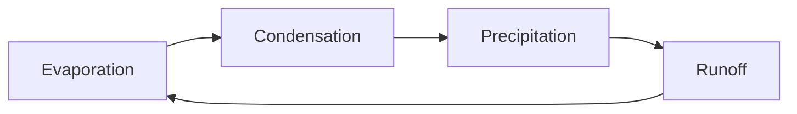

# Mermaid Circular Layout for Obsidian

An Obsidian plugin that adds a circular layout to mermaid flowcharts.
Cycles render as rings instead of dagre's flattened ladders. A diagram
with side branches keeps its ring: the cycle stays on the circle and
the rest hangs off it radially, the way a textbook draws the Krebs
cycle.

The layout itself lives in
[mermaid-layout-circular](https://github.com/AndrewBroz/mermaid-layout-circular),
which has pictures of the output and notes on how the geometry works.
This plugin is a thin adapter: on load it registers the layout with the
mermaid instance Obsidian already bundles.

## Usage

Opt in per diagram with frontmatter inside the mermaid fence:

````

````

Diagrams without the frontmatter are untouched.

## Installation

Until the plugin is in the community catalog, install it manually:

1. Download `main.js` and `manifest.json` from the latest release, or
   build them yourself (below).
2. Copy both into `<your vault>/.obsidian/plugins/mermaid-circular/`.
3. In Obsidian, enable the plugin under Settings, Community plugins.

## Building from source

```sh
npm install
npm run build
```

This bundles the layout engine and the adapter into `main.js`. During
development, `npm run dev` rebuilds on change.

## Requirements

Obsidian 1.13.0 or later.

> [!TIP]
> Mermaid keeps registered layouts for the life of the app process, and
offers no way to unregister one. After disabling the plugin, the layout
remains available until Obsidian restarts.

## License

MIT
