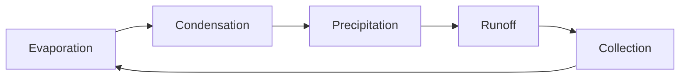
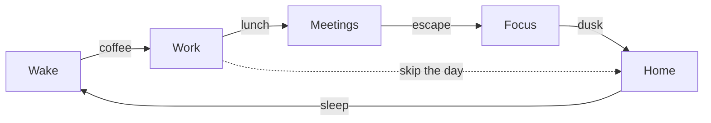
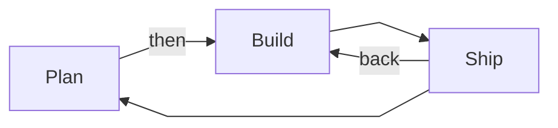
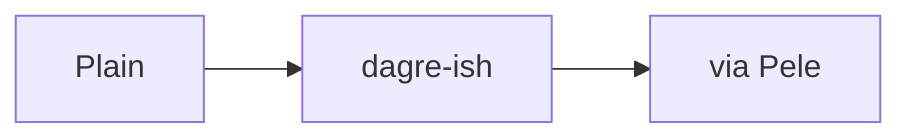

# Circular

```mermaid
---
config:
  layout: circular
---
flowchart LR
  E[Evaporation] --> C[Condensation]
  C --> P[Precipitation]
  P --> R[Runoff]
  R --> O[Collection]
  O --> E
```

```mermaid
---
config:
  layout: circular-ccw
---
flowchart LR
  W[Wake] -->|coffee| Wk[Work]
  Wk -->|lunch| M[Meetings]
  M -->|escape| F[Focus]
  F -->|dusk| Hm[Home]
  Hm -->|sleep| W
  Wk -.->|skip the day| Hm
```

Straight edges: a triangle with a labeled opposite pair.

```mermaid
---
config:
  layout: circular
  flowchart:
    curve: linear
---
flowchart LR
  A[Plan] -->|then| B[Build] --> C[Ship] --> A
  C -->|back| B
```

```mermaid
flowchart LR
  A[Plain] --> B[dagre-ish] --> C[via Pele]
```
