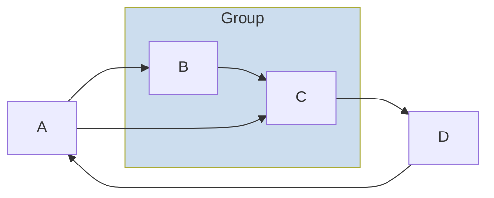
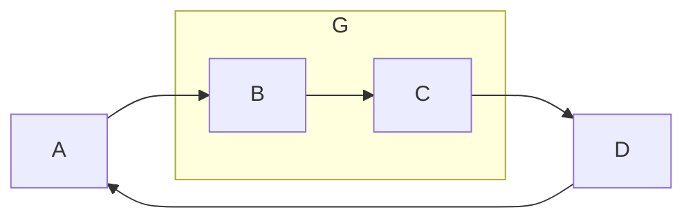

# Groups

A filled group that an edge crosses.

```mermaid
---
config:
  layout: circular
---
flowchart LR
  A --> B --> C --> D --> A
  subgraph G [Group]
    B
    C
  end
  style G fill:#cde
  A --> C
```

A collapsed subgraph.

```mermaid
---
config:
  layout: circular
---
flowchart LR
  A --> B
  subgraph G
    B --> C
  end
  C --> D --> A
  G@{ view: collapsed }
```
